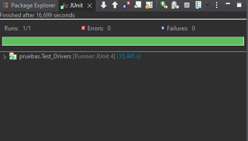
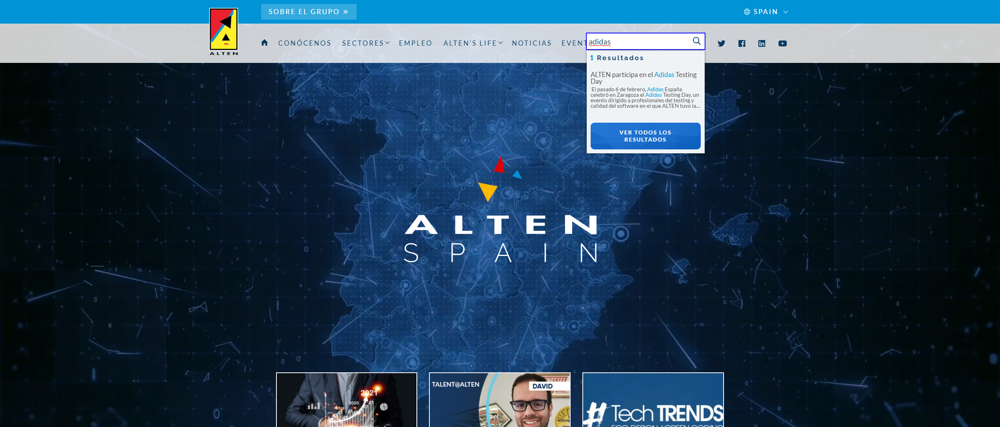

# Plan de pruebas - Alten

Repositorio de la prueba de Automatización de pruebas - Alten.es de Jaime Suárez González.

### Pre-requisitos

* Eclipse
* Java 
* Maven
* Junit
* Selenium 
* Google Chrome  
* Git

### Lanzar la aplicación

_Una vez instalados los requisitos solo tendremos que lanzar la aplicación o click derecho en la clase Test_Drivers y pulsar Run as: JUnit Test._

## Estructura del proyecto
    .
    ├── Drivers                               # Chrome driver
    ├── ScreenShot_Folder                     # Capturas de pantallas automáticas
    ├── src                     
    │   ├── main          
    │   └── test/java/pruebas                 # Clase principal que ejecuta la prueba
    ├── target                    
    ├── _PruebaTecnica_auto_Selenium.docx     # Respuesta preguntas teóricas
    ├── pom.xml                               # Archivo de configuración Modelo Base Page Object 
    └── README.md

## Capturas

*Test realizado sin errores.

## Autor

Trabajo realizado por Jaime Suárez González.

